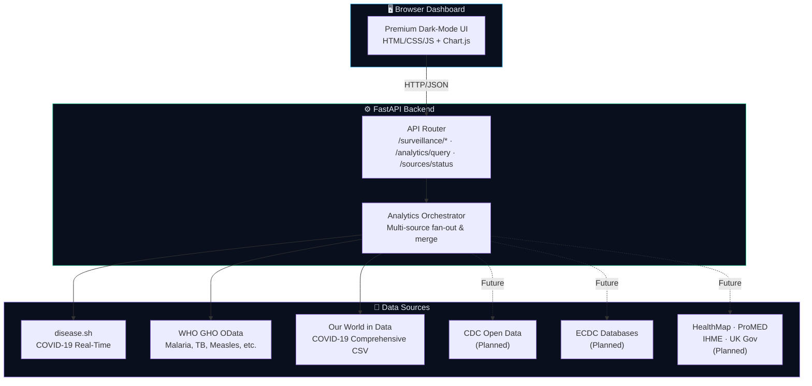

<div align="center">

# 🧬 MedFusion

### Interactive Disease Surveillance Intelligence Dashboard

[](https://python.org)
[](https://fastapi.tiangolo.com)
[](LICENSE)
[]()

*A multi-source epidemiological analytics platform with a premium dark-mode dashboard, powered by real-time data from disease.sh, WHO GHO, and Our World in Data.*

</div>

---

## 📖 Overview

**MedFusion** is a full-stack disease surveillance prototype built for the MedFusion Hackfest. It aggregates data from multiple public health APIs into a unified, interactive intelligence dashboard that enables:

- **Real-time monitoring** of global and country-level disease burden
- **Multi-source data fusion** from disease.sh, WHO Global Health Observatory, and Our World in Data
- **Interactive analytics** with derived metrics (incidence, growth rate, moving averages)
- **Cross-region comparison** using per-capita normalization
- **Extensible architecture** designed for seamless plug-in of additional data providers (CDC, ECDC, HealthMap, ProMED, IHME, UK Gov)

> ⚠️ **Disclaimer**: This is a hackfest prototype and is **not intended for clinical use or public health decision-making**.

---

## 🏗️ Architecture



### Request Flow

1. **Dashboard** sends requests to the FastAPI backend (e.g., `POST /analytics/query`)
2. **API Router** validates parameters and delegates to the analytics orchestrator
3. **Analytics Orchestrator** fans out to selected data sources in parallel
4. **Service Layer** fetches, normalizes, and caches upstream data
5. **Merge & Compute** — series from multiple sources are merged by date; derived metrics (incidence, growth rate, 7d moving average) are computed server-side
6. **Response** — structured JSON payload optimized for chart rendering and KPI display

---

## 🛠️ Tech Stack

| Layer | Technology |
|-------|-----------|
| **Backend** | Python 3.10+, FastAPI, Uvicorn |
| **HTTP Client** | httpx (async) |
| **Validation** | Pydantic v2 |
| **Frontend** | HTML5, CSS3 (dark glassmorphism), vanilla JavaScript |
| **Charting** | Chart.js (via CDN) |
| **Data Sources** | disease.sh, WHO GHO OData, Our World in Data CSV |

---

## 📂 Project Structure

```
MedFusion/
├── app/
│   ├── main.py                  # FastAPI app, routes, CORS, static mount
│   └── services/
│       ├── disease_service.py   # disease.sh COVID-19 API integration
│       ├── analytics_service.py # Multi-source orchestrator + derived metrics
│       ├── who_service.py       # WHO GHO OData API integration
│       ├── owid_service.py      # Our World in Data CSV integration
│       ├── cdc_service.py       # CDC Open Data (scaffolded)
│       ├── ecdc_service.py      # ECDC databases (scaffolded)
│       ├── healthmap_service.py # HealthMap alerts (scaffolded)
│       ├── promed_service.py    # ProMED Mail RSS (scaffolded)
│       ├── ihme_service.py      # IHME GHDx India (scaffolded)
│       └── ukgov_service.py     # UK Gov health stats (scaffolded)
├── frontend/
│   └── index.html               # Single-page dashboard (dark glassmorphism)
├── requirements.txt
└── README.md
```

---

## 🚀 Setup & Installation

### Prerequisites

- Python 3.10 or higher
- pip / venv

### 1. Clone the Repository

```bash
git clone <repository-url>
cd MedFusion
```

### 2. Create & Activate Virtual Environment

```bash
python -m venv .venv
source .venv/bin/activate    # Linux/macOS
# .venv\Scripts\activate     # Windows
```

### 3. Install Dependencies

```bash
pip install -r requirements.txt
```

### 4. Start the Backend

```bash
uvicorn app.main:app --reload --host 0.0.0.0 --port 8000
```

### 5. Open the Dashboard

Navigate to **[http://localhost:8000/ui/](http://localhost:8000/ui/)** in your browser.

---

## 📡 API Endpoints

| Method | Endpoint | Description |
|--------|----------|-------------|
| `GET` | `/health` | Health check |
| `GET` | `/surveillance/ping` | Smoke test |
| `GET` | `/surveillance/global` | Global disease snapshot |
| `GET` | `/surveillance/country/{country}?days=N` | Country snapshot + trend |
| `POST` | `/analytics/query` | Interactive multi-source analytics |
| `GET` | `/sources/status` | Data source availability |

### Example: Analytics Query

```bash
curl -X POST http://localhost:8000/analytics/query \
  -H "Content-Type: application/json" \
  -d '{
    "disease": "COVID-19",
    "region": "India",
    "time_window": "30d",
    "metrics": ["incidence", "7d_moving_avg"],
    "sources": ["disease_sh", "who", "owid"]
  }'
```

### Example: Data Sources Status

```bash
curl http://localhost:8000/sources/status
```

---

## 🎨 Dashboard Features

- **Premium dark-mode UI** with glassmorphism effects and animated gradients
- **6 KPI cards**: Global Cases, Global Deaths, Region Active, Cases/1M, Deaths/1M, Recovery Rate
- **4 interactive charts**: Epidemiological Curve, Deaths Trend, Incidence/100k, Growth Rate
- **13 diseases**: COVID-19, Influenza, Dengue, Malaria, Tuberculosis, Measles, Cholera, HIV/AIDS, Ebola, Hepatitis B, Polio, Yellow Fever, Zika
- **30+ countries** grouped by continent with flag emojis
- **Data source toggles** — select which providers to include
- **Time window pills** — 14d, 30d, 90d, 180d, 1y, Full
- **Live backend status** indicator in the navbar
- **Responsive layout** for desktop, tablet, and mobile

---

## 📊 Data Sources

| Source | Status | Coverage |
|--------|--------|----------|
| **disease.sh** | ✅ Active | Real-time COVID-19 (global + 200+ countries) |
| **WHO GHO** | ✅ Active | Malaria, TB, Measles, Cholera, Hepatitis B, HIV/AIDS, Polio, Yellow Fever |
| **Our World in Data** | ✅ Active | COVID-19 comprehensive (cases, deaths, testing, vaccinations) |
| **CDC Open Data** | 🔶 Planned | US CDC surveillance + FluView |
| **ECDC** | 🔶 Planned | European disease monitoring |
| **HealthMap** | 🔶 Planned | Automated outbreak alerts |
| **ProMED Mail** | 🔶 Planned | Curated outbreak reports |
| **IHME GHDx** | 🔶 Planned | India disease burden |
| **UK Gov** | 🔶 Planned | UK health statistics |

---

## 🧩 Extending with New Sources

Each data source is a self-contained module in `app/services/`. To add a new source:

1. Create `app/services/your_source_service.py`
2. Implement async functions that return `List[Dict]` with `{date, cases, deaths, source}` schema
3. Register the source in `DATA_SOURCES` within `analytics_service.py`
4. Add fan-out logic in `run_analytics_query()` to call your service
5. Add a toggle in the sidebar of `frontend/index.html`

---

## 📝 License

This project is a hackfest prototype. See individual data source APIs for their respective terms of use.
